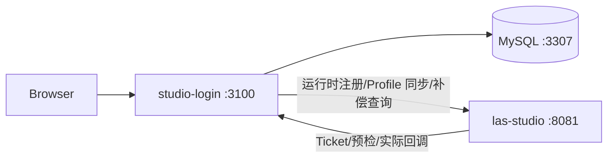

# Studio 与 studio-login 本地联调测试手册

> 适用版本：Studio `release-0.3.0`、studio-login MVP 0.1.0  
> 验证日期：2026-08-25  
> 原则：所有示例均为本机占位配置，不得把真实密码、Token 或客户信息写入文档、命令记录和 Git。

## 1. 联调范围

本手册验证以下链路：

1. Studio 签发单应用 Integration Token。
2. studio-login 启动时创建 `SYSTEM_ADMIN`，管理员登录后配置公网地址并向 Studio 注册 Ticket 地址；发布资源配置组时用真实 LAS API Key 注册预检和实际用量地址。
3. 管理员发布配置组并创建子账号，Profile 同步到 Studio。
4. Studio 调用 baseline 预检，studio-login 完成额度预占。
5. Studio 主动回调实际用量，studio-login 完成结算。
6. 主动回调丢失时，studio-login 定时查询 `/api/v1/open/usage/get` 并补结算。

补偿行为以 `release-0.1.3` 为基准：只采信 Studio 的权威终态，并复用正常回调事务完成幂等结算。



## 2. 前置条件

- Java 17。不要使用 Java 24 编译当前工程。
- Node.js 20 或更高版本。
- MySQL 8；本手册使用 Docker 映射到 `127.0.0.1:3307`。
- 本机端口 `8081`、`3100`、`3307` 未被占用。
- 两个代码目录分别记为 `<STUDIO_REPO>` 和 `<LOGIN_REPO>`。

检查环境：

```bash
java -version
node --version
docker --version
lsof -nP -iTCP:8081 -sTCP:LISTEN
lsof -nP -iTCP:3100 -sTCP:LISTEN
lsof -nP -iTCP:3307 -sTCP:LISTEN
```

## 3. 启动 MySQL

有 Compose 插件时，在 `<LOGIN_REPO>` 执行：

```bash
docker compose -f deploy/local/compose.yml up -d
```

没有 Compose 插件时可执行：

```bash
docker run -d --name studio-login-mysql \
  -e MYSQL_ALLOW_EMPTY_PASSWORD=yes \
  -e MYSQL_DATABASE=studio_login \
  -p 127.0.0.1:3307:3306 \
  mysql:8.0 \
  --character-set-server=utf8mb4 \
  --collation-server=utf8mb4_0900_ai_ci
```

确认 MySQL 就绪：

```bash
docker exec studio-login-mysql mysqladmin ping -uroot
```

## 4. 本地启动 Studio

### 4.1 构建

在 `<STUDIO_REPO>` 执行：

```bash
export JAVA_HOME=$(/usr/libexec/java_home -v 17)
export PATH="$JAVA_HOME/bin:$PATH"
./mvnw -B -ntp -s settings.xml -pl las-studio-starter -am package -DskipTests
```

### 4.2 启动参数说明

- `LAS_STUDIO_INTEGRATION_ALLOW_LOCAL_CALLBACK_URLS=true` 只允许本机联调使用 HTTP 私网回调；默认值为 `false`。
- 线上不得打开该开关，公网接入地址仍必须为 HTTPS。
- H2 只用于 Studio 本地联调；studio-login 仍强制使用 MySQL。
- 关闭与本次无关的任务消费者，避免读取本机其他 Redis 测试数据。

### 4.3 启动命令

先在当前终端设置一个仅用于本机的 Admin Key，不要使用线上值：

```bash
export LOCAL_STUDIO_ADMIN_KEY='<LOCAL_ONLY_ADMIN_KEY>'
```

然后启动：

```bash
LAS_STUDIO_GATEWAY_ENABLED=true \
LAS_STUDIO_GATEWAY_ADMIN_INTERNAL_API_KEY="$LOCAL_STUDIO_ADMIN_KEY" \
LAS_STUDIO_INTEGRATION_ALLOW_LOCAL_CALLBACK_URLS=true \
SERVER_PORT=8081 \
java -jar las-studio-starter/target/las-studio-starter-0.3.0.jar \
  --las.scheduler.enable-system-schedulers= \
  --task-management.job.consumer-enabled=false \
  --spring.sql.init.mode=embedded \
  --spring.sql.init.schema-locations=classpath:db/release/studio_0.1.0.sql,classpath:db/release/studio_0.2.0.sql,classpath:db/release/0.2.1_ddl.sql,classpath:db/release/0.3.0_ddl.sql \
  --spring.sql.init.data-locations=classpath:db/local/h2_release_compatibility.sql,classpath:db/release/0.3.0_dml.sql \
  --spring.sql.init.continue-on-error=true \
  --spring.jpa.hibernate.ddl-auto=none \
  --spring.jpa.properties.hibernate.hbm2ddl.auto=none \
  --spring.quartz.jdbc.initialize-schema=never
```

健康检查：

```bash
curl -fsS http://127.0.0.1:8081/actuator/health
```

## 5. 签发本地 Integration Token

调用 Studio Admin API；响应中的 `data.token` 只出现一次：

```bash
curl -fsS -X POST http://127.0.0.1:8081/admin/api/settings/integration-credentials \
  -H "X-LAS-Internal-Api-Key: $LOCAL_STUDIO_ADMIN_KEY" \
  -H 'Content-Type: application/json' \
  -d '{"appId":"studio"}'
```

将 Token 通过安全方式写入 `<LOGIN_REPO>/.env`，不要提交该文件，也不要在终端打印 Token。重复签发返回 409；
需要更新时显式调用 `POST /admin/api/settings/integration-credentials/studio/rotate`。

## 6. 启动 studio-login

在 `<LOGIN_REPO>` 执行：

```bash
cp .env.example .env
chmod 600 .env
```

填写以下占位项：

```dotenv
STUDIO_LOGIN_DATABASE_URL=mysql://root@127.0.0.1:3307/studio_login
STUDIO_LOGIN_ACCOUNT_ID=studio
STUDIO_LOGIN_ADMIN_USERNAME=admin
STUDIO_LOGIN_ADMIN_PASSWORD=<LOCAL_ADMIN_PASSWORD_AT_LEAST_12_CHARS>
LAS_STUDIO_INTEGRATION_TOKEN=<TOKEN_ISSUED_BY_STUDIO>
```

启动：

```bash
npm install
npm run build
npm start
```

成功标志：

- 日志出现 `Server listening at http://127.0.0.1:3100`。
- `curl -fsS http://127.0.0.1:3100/` 返回登录页。
- 管理员登录后在“Studio 服务连接”填写 `http://127.0.0.1:8081` 和 `http://127.0.0.1:3100`。
- 保存后 Studio 日志显示 `/integration/api/v1/app-ticket-configs/register` 为 200；发布资源配置组后 `/integration/api/v1/usage-endpoints/register` 为 200。

## 7. 正常计费链路验证

推荐直接执行真实 MySQL 集成测试。测试会启动 Mock Studio，覆盖管理员初始化、运行时注册、Profile 同步、
Ticket、预占、正常回调、回调丢失补偿和重复补偿幂等：

```bash
docker exec studio-login-mysql mysql -uroot \
  -e 'CREATE DATABASE studio_login_test CHARACTER SET utf8mb4 COLLATE utf8mb4_0900_ai_ci'

STUDIO_LOGIN_DATABASE_URL=mysql://root@127.0.0.1:3307/studio_login_test \
STUDIO_LOGIN_ACCOUNT_ID=studio \
STUDIO_LOGIN_ADMIN_USERNAME=admin \
STUDIO_LOGIN_ADMIN_PASSWORD='<LOCAL_TEST_PASSWORD>' \
LAS_STUDIO_INTEGRATION_TOKEN='<LOCAL_TEST_TOKEN_AT_LEAST_32_CHARS>' \
npm run db:migrate

STUDIO_LOGIN_TEST_DATABASE_URL=mysql://root@127.0.0.1:3307/studio_login_test npm test
```

期望：3 个集成用例全部通过，其中计费闭环用例应断言：

- 预检后产生 `RUNNING` 任务并增加 `reserved_amount`。
- 正常 `SUCCEEDED` 回调释放预占并写入实际金额。
- 模拟回调丢失后，对账查询到 `SUCCEEDED` 并补结算。
- 再次对账扫描不到终态任务，不重复记账。

## 8. 真实双服务 HTTP 冒烟

### 8.1 注册和 Profile

1. 访问 `http://127.0.0.1:3100`，只应看到登录入口。
2. 使用 `.env` 中的管理员登录。
3. 创建并发布配置组，再创建一个子账号。
4. Studio `/integration/api/v1/user-profiles/upsert` 应返回 200；studio-login 创建子账号接口也应返回 200。

### 8.2 baseline 预检和回调

使用资源配置组中的 LAS API Key，由 Studio 发起或在受控测试脚本中调用：

```http
POST http://127.0.0.1:3100/api/studio/baseline/tasks
X-App-Id: studio
X-LAS-Api-Key: <LAS_API_KEY_FROM_RESOURCE_CONFIG>
Content-Type: application/json

{
  "RequestId": "local-request-001",
  "UserId": "<SUBACCOUNT_USER_ID>",
  "Items": [{"BillingItemId":"<CONFIGURED_ITEM>","Unit":"request","Usage":5}]
}
```

终态回调：

```http
POST http://127.0.0.1:3100/api/studio/baseline/tasks/callback
X-App-Id: studio
X-LAS-Api-Key: <LAS_API_KEY_FROM_RESOURCE_CONFIG>
Content-Type: application/json

{
  "RequestId": "local-request-001",
  "UserId": "<SUBACCOUNT_USER_ID>",
  "Status": "SUCCEEDED",
  "Items": [{"BillingItemId":"<CONFIGURED_ITEM>","Unit":"request","Usage":3}]
}
```

两个接口都应返回 `{"code":200,"message":"success"}`，账单金额应按预检时保存的单价快照乘实际用量计算。

## 9. 回调丢失补偿验证

### 9.1 确定性自动验证

执行第 7 节的 `npm test`。这是无需真实算子凭证即可稳定复现 `RUNNING -> SUCCEEDED` 补偿的首选方式。

### 9.2 真实任务验证

1. 将可选参数临时调小后重启 studio-login：

```dotenv
STUDIO_LOGIN_RECONCILE_INTERVAL_SECONDS=10
STUDIO_LOGIN_RECONCILE_OLDER_THAN_MINUTES=0
STUDIO_LOGIN_RECONCILE_BATCH_SIZE=20
```

2. 发起一个已配置计费项的真实 Studio 任务。
3. 在受控环境中让实际回调暂时不可达，但保持 Studio 的任务及用量数据正常落库。
4. 恢复 studio-login，等待最多 15 秒。
5. 日志应出现 `billing_reconcile_completed`，其中 `settled=1`。
6. MySQL 核对：

```sql
SELECT request_id, status, estimated_amount, actual_amount, finished_at
FROM studio_tasks
WHERE request_id = '<REQUEST_ID>';

SELECT subject_type, subject_id, reserved_amount, actual_amount
FROM period_usage
WHERE app_id = 'studio' AND billing_period = '<YYYY-MM>';
```

期望任务进入 `SUCCEEDED` 或 `FAILED` 终态，预占被释放；重复等待一轮后金额不再变化。若 Studio 仍返回
`PROCESSING` 或没有对应记录，任务保持 `RUNNING`，不得直接释放额度。

## 10. 本次联调记录

本地环境实际完成并通过：

| 检查项 | 结果 |
| --- | --- |
| Studio H2 发布 SQL 初始化 | PASS |
| Studio 健康检查 | HTTP 200 |
| studio-login MySQL 迁移和启动 | PASS |
| Integration Token 签发与运行时注册 | PASS |
| Ticket/Usage Endpoint 注册 | HTTP 200 |
| 子账号 Profile 同步 | HTTP 200 |
| baseline 预检 | HTTP 200 |
| Studio `/api/v1/open/usage/get` 鉴权查询 | HTTP 200 |
| 实际用量回调 | HTTP 200 |
| 账单金额校验 | PASS |
| 回调丢失补偿及重复执行幂等 | 自动化集成测试 PASS |

## 11. 常见问题

| 现象 | 原因与处理 |
| --- | --- |
| Maven 编译出现 `TypeTag :: UNKNOWN` | 使用了 Java 24；切换到 Java 17 |
| Studio 注册返回回调 URL 非法 | 本地未开启 `LAS_STUDIO_INTEGRATION_ALLOW_LOCAL_CALLBACK_URLS=true`；线上应改用公网 HTTPS，不得开启该开关 |
| Profile 同步提示 H2 缺少列 | 确认启动命令加载了 `db/local/h2_release_compatibility.sql` |
| studio-login 启动失败且返回 409 | appId 已存在但地址或 Key 冲突；确认配置，必要时显式轮换 Token 后同步更新 `.env` |
| 对账一直 `skipped` | Studio 返回 `PROCESSING` 或没有该 RequestId；先确认 Studio 用量已进入终态 |
| 对账 `failed` | 检查公网接入地址、AppId、派生 Key、UserId 和 `/api/v1/open/usage/get` 返回结构，不要打印完整凭证 |

联调结束后停止两个进程，并删除或妥善保管本地 `.env`；测试 Token 不得复用到其他环境。
