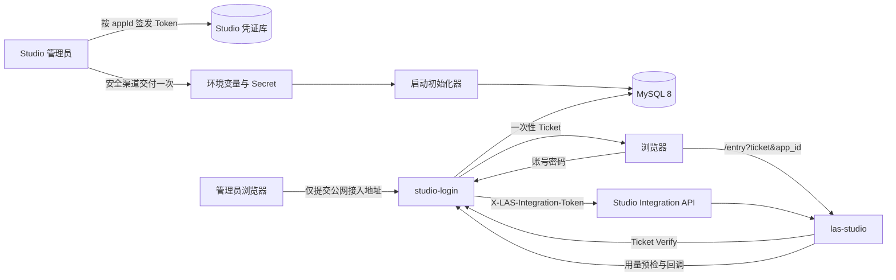
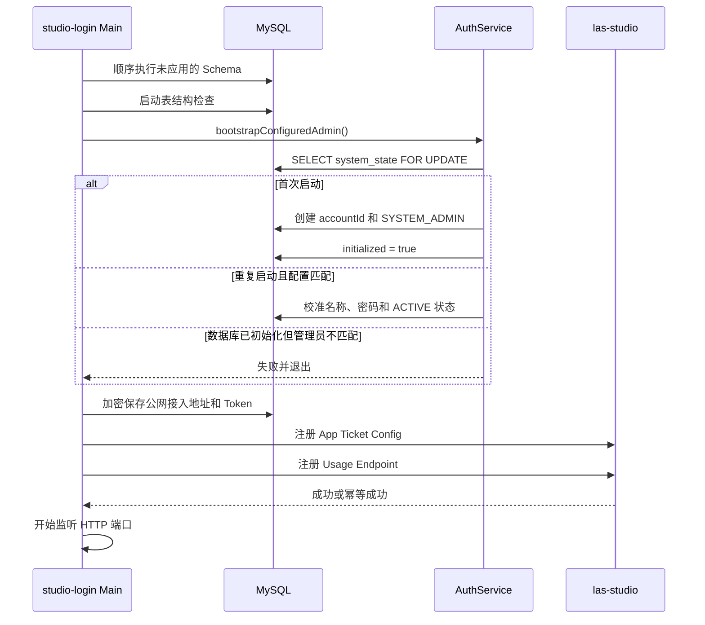
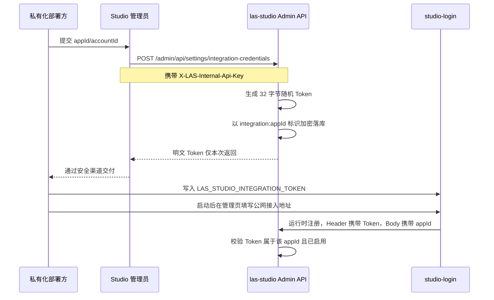
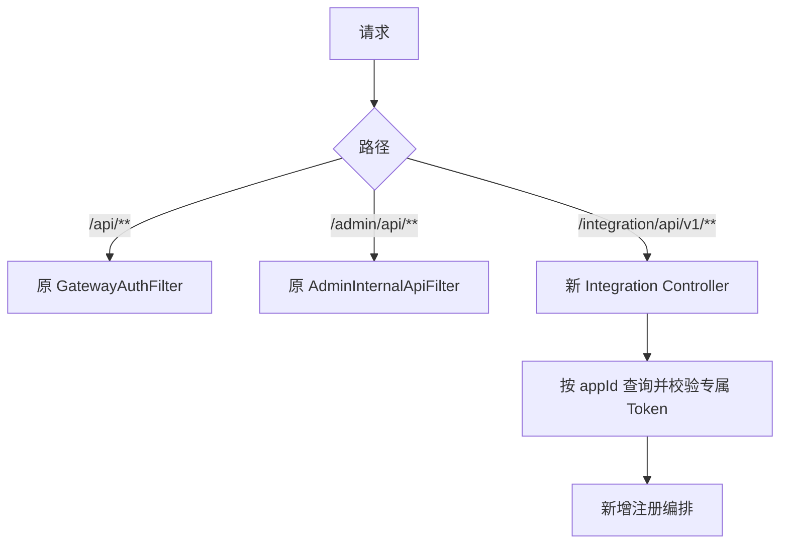
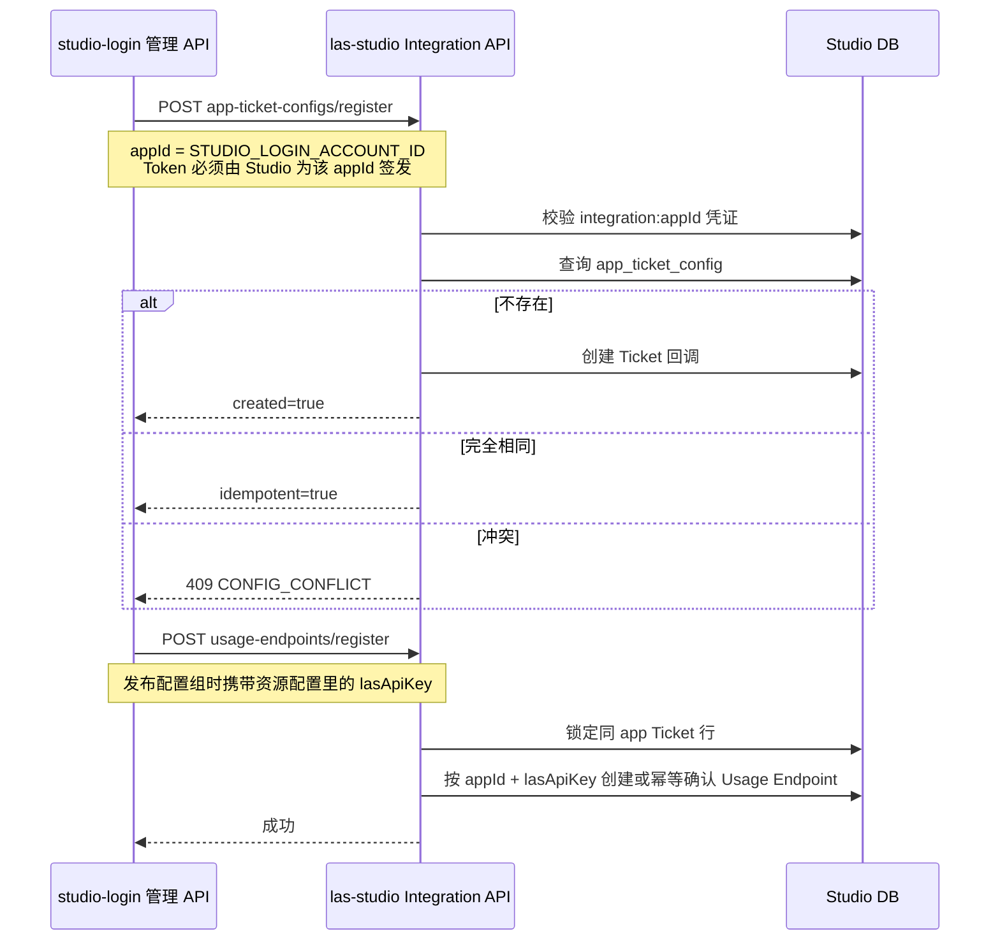
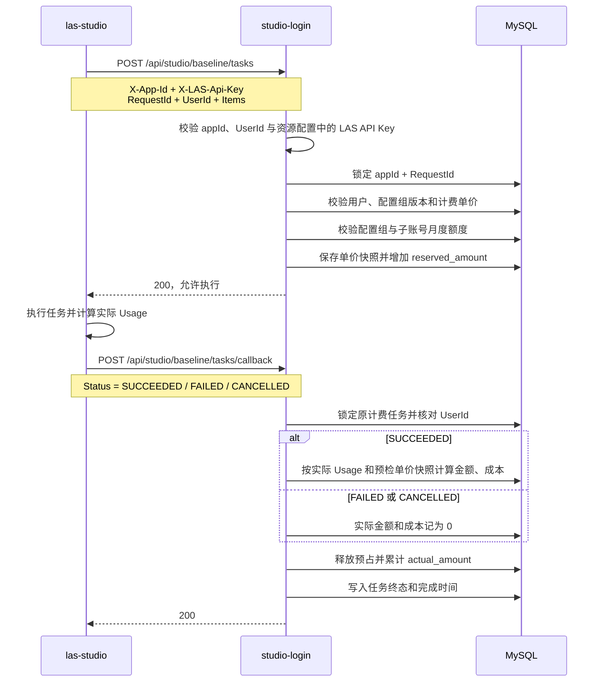
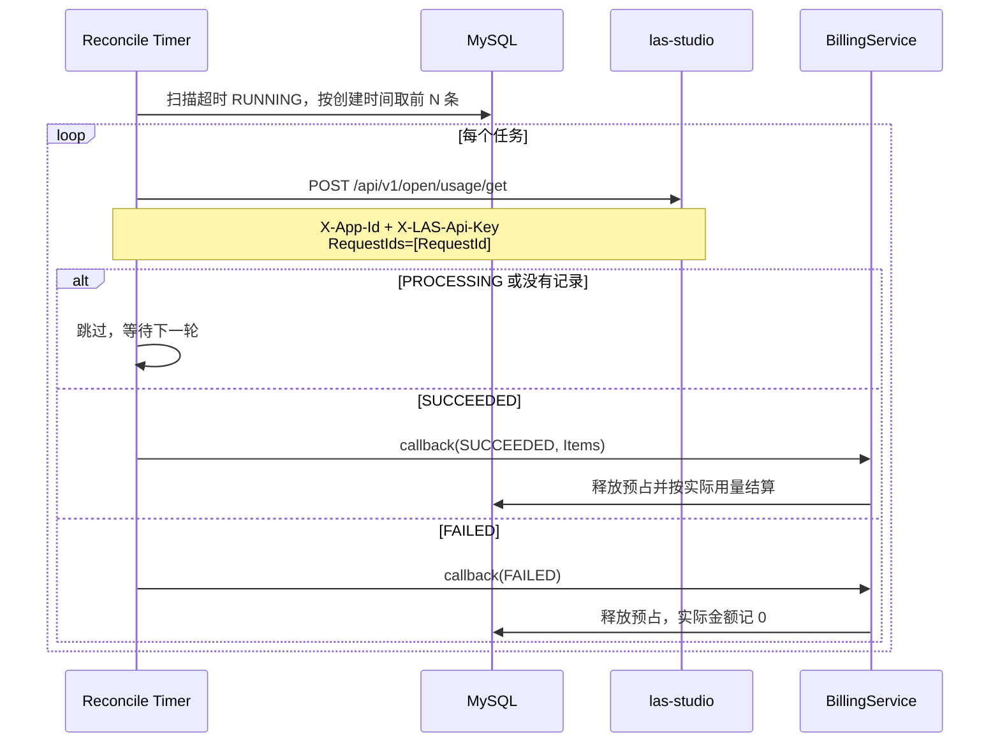
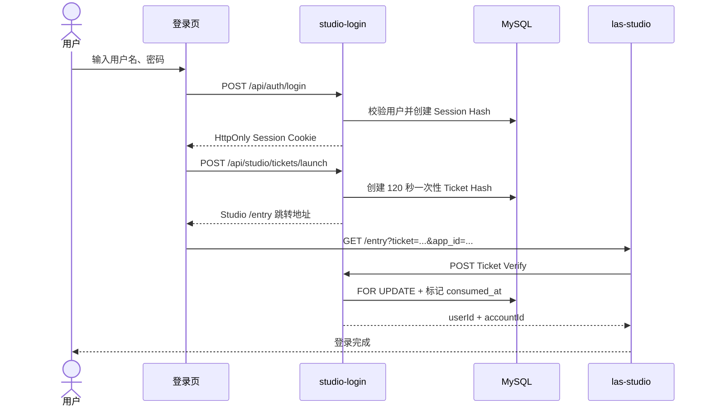

# Studio Login MVP 设计与实现

> 状态：已实现  
> 更新时间：2026-08-25  
> 技术栈：TypeScript、Fastify、MySQL 8

## 1. 最终口径

- `appId = accountId`，唯一标记一个企业组织。
- 本版本按单企业部署：企业和启动管理员由环境变量指定，公网接入地址在服务启动后由管理员配置。该地址既是用户访问 Studio 的入口，也是 Studio 回调 Login 的入口。
- 私有化部署方先提交 `appId`，由 Studio 管理员为该 `appId` 签发专属 Integration Token，再通过安全渠道交付。
- 服务启动时自动执行数据库迁移并创建或校准 `SYSTEM_ADMIN`，不依赖公网地址或 Studio 可用性。
- 管理员登录后填写一个公网接入地址，服务先向 Studio 注册 Ticket；发布资源配置组时再用真实 LAS API Key 注册计费回调。注册失败不影响服务继续运行。
- 浏览器页面只有登录。登录成功后签发一次性 Ticket，并直接跳转 Studio `/entry`。
- 不修改 Studio Web。
- 不引入 Redis、H2 或消息队列；Session、Ticket、配置、限流和计费状态都在 MySQL。
- Studio 只新增独立 `/integration/api/v1/**` 接口，原 Gateway 和 `/admin/api/**` 逻辑保持不变。

## 2. 极简配置

`.env.example` 只保留五项必填配置：

```dotenv
STUDIO_LOGIN_DATABASE_URL=mysql://root@127.0.0.1:3307/studio_login
STUDIO_LOGIN_ACCOUNT_ID=studio
STUDIO_LOGIN_ADMIN_USERNAME=admin
STUDIO_LOGIN_ADMIN_PASSWORD=
LAS_STUDIO_INTEGRATION_TOKEN=
```

生产环境要求管理员在页面填写的公网接入地址使用 HTTPS，管理员密码至少 12 个字符。`LAS_STUDIO_INTEGRATION_TOKEN` 填写 Studio 根据 `STUDIO_LOGIN_ACCOUNT_ID` 签发的专属 Token；示例文件不提供任何真实密码或令牌。

### 2.1 被移除的四项配置

| 原配置 | 最终方案 | 是否还需用户配置 |
| --- | --- | --- |
| `STUDIO_LOGIN_ENCRYPTION_KEY` | 对 Integration Token 做带用途前缀的 SHA-256 派生，得到 32 字节 AES-256-GCM Key | 否 |
| `STUDIO_LOGIN_SESSION_TTL_SECONDS` | 固定为 7 天 | 否 |
| `STUDIO_LOGIN_SESSION_COOKIE_SECURE` | 根据请求协议（含可信代理的 `X-Forwarded-Proto`）自动启用 | 否 |
| `STUDIO_LOGIN_TICKET_TTL_SECONDS` | 固定为 120 秒 | 否 |

Encryption Key 不能在功能上取消，因为配置组中包含访问凭证，仍需加密落库。本版本用必填且高熵的 Integration Token 派生密钥，减少一个独立配置项。

该简化存在明确约束：更换 Integration Token 会改变派生密钥，历史配置组密文将无法解密。因此 Token 轮换时必须重新录入并发布配置组。若后续需要无损轮换或多 Studio 集群，应恢复独立主密钥并增加密钥版本。

## 3. 系统架构



职责边界：

- 环境变量决定唯一企业、系统管理员和两端地址。
- `studio-login` 管理用户、Session、Ticket、资源配置和后付费数据。
- `las-studio` 继续管理运行时 Profile、Ticket 校验调用和用量上报。
- 浏览器永远看不到 Integration Token、资源密钥或数据库密文。

## 4. 启动初始化



管理员初始化使用 `system_state(id=1) FOR UPDATE` 串行化。数据库已经初始化但找不到环境变量指定的管理员时，服务拒绝自动创建第二个 `SYSTEM_ADMIN`。

每次启动会使用环境变量中的密码更新该管理员密码。这使部署配置成为管理员凭据的唯一事实来源，也意味着修改环境变量并重启即可轮换密码。

### 4.1 启动失败条件

- MySQL 不可连接或 Schema 迁移失败。
- 生产环境使用非 HTTPS 公网接入地址。
- 管理员配置与已初始化数据库不匹配。
- Integration Token 缺失或过短。
- 公网接入地址不可访问。
- Studio 返回非 2xx，或已有相同 `appId` 但配置冲突。

服务不会忽略这些错误继续启动。

## 5. LAS_STUDIO_INTEGRATION_TOKEN 的签发与使用

它是 Studio 为单个 `appId` 签发的服务凭证，不是管理员登录密码，也不是用户 API Key。每个私有化部署使用自己的 Token，不共享全局 Token，也不依赖中心化服务在运行时动态取 Token。

### 5.1 交付流程



Studio 管理接口：

| 方法 | 路径 | 说明 |
| --- | --- | --- |
| POST | `/admin/api/settings/integration-credentials` | 为 `appId` 首次签发；已存在返回 409 |
| GET | `/admin/api/settings/integration-credentials` | 脱敏列表，只返回末四位 hint |
| POST | `/admin/api/settings/integration-credentials/{appId}/rotate` | 显式轮换并仅返回一次新 Token |
| PATCH | `/admin/api/settings/integration-credentials/{appId}/enabled` | 启用或停用 |

以上接口仍是内部 Admin API，必须携带 `X-LAS-Internal-Api-Key`。签发和轮换响应是唯一会返回明文 Token 的位置；列表、日志和数据库查询接口均不返回明文。

### 5.2 运行时用途

它有三个用途：

1. `studio-login` 调用 Studio 独立 Integration API 时放入 `X-LAS-Integration-Token`。
2. 在 `studio-login` 内派生配置组的 AES-256-GCM 加密密钥。
3. 注册用量回调时使用资源配置组中的真实 LAS API Key；Studio 的 `app_usage_endpoint.las_api_key` 与任务执行时的 `X-LAS-API-KEY` 保持同一形态，不再写入由 Integration Token 派生的回调 Key。

安全约束：

- 由 Studio 使用 32 字节安全随机数生成 Base64URL Token，用户不得自行约定弱口令。
- Studio 使用现有 AES-GCM 能力加密落库，并以 `integration:<appId>` 与原签名凭证隔离。
- 不写入代码、文档、浏览器或本地存储；仅签发/轮换响应返回一次。
- 日志对该 Header 和请求字段做脱敏。
- Studio 先按 `appId` 定位凭证，再解密并使用常量时间比较；A 应用 Token 不能操作 B 应用。
- Integration Token 不写入 `app_usage_endpoint.las_api_key`；该字段只保存资源配置组里的真实 LAS API Key，用于 Studio 找到同一 API Key 对应的用量回调。
- Token 轮换后需把新值更新到对应 `studio-login` 并重启。由于 `studio-login` 的配置加密密钥也随之变化，历史配置组需重新录入并发布。

## 6. Studio 独立 Integration API

| 方法 | 路径 | 语义 |
| --- | --- | --- |
| POST | `/integration/api/v1/app-ticket-configs/register` | 首次登记 Ticket 回调；相同请求幂等，不同请求 409 |
| POST | `/integration/api/v1/usage-endpoints/register` | 发布资源配置组时按真实 LAS API Key 登记预检/实际用量回调；相同请求幂等 |
| POST | `/integration/api/v1/user-profiles/upsert` | 写入用户 Resource Profile |

三个接口都要求 Header Token 与 Body 中的 `appId` 匹配：

```http
X-LAS-Integration-Token: <service token>
```

### 6.1 与 Gateway 的隔离



本次没有修改两个原 Filter：

- `/admin/api/**` 仍必须携带 `X-LAS-Internal-Api-Key`。
- `/api/**` 原鉴权、公共路径和运行时行为不变。
- 新认证不是全局 Filter，只在新控制器入口执行。

### 6.2 回调 URL 安全

Studio Integration API 只接受公网 HTTPS 回调，拒绝：

- HTTP。
- localhost、回环、私网或本地域名/IP。
- URL userinfo。
- fragment。

本地测试由 `studio-login` 的 `APP_ENV=test/local` 允许 HTTP；Studio 生产侧仍要求公网 HTTPS。

## 7. 运行时注册交互



`studio-login` 根据管理员运行时配置的两个基础地址派生：

- Studio 入口：`studioBaseUrl + /entry`。
- Ticket 校验：`publicBaseUrl + /api/internal/studio/tickets/verify?app_id=...`。
- 预检回调：`publicBaseUrl + /api/studio/baseline/tasks`。
- 实际用量回调：`publicBaseUrl + /api/studio/baseline/tasks/callback`。

### 7.1 计费预检与实际用量回调

当前实现包含完整的 MVP 计费回调闭环。Studio 沿用现有 Usage Reporting 逻辑，在任务执行前调用预检接口，任务进入终态后调用实际用量接口；`studio-login` 负责额度校验、预占、结算和账单汇总。



预检接口 `POST /api/studio/baseline/tasks` 已实现：

- 使用 `X-App-Id` 定位企业，并使用 `UserId` 对应资源配置组中的 LAS API Key 校验 Studio 回调身份。
- 校验用户存在且为 `ACTIVE`，资源配置组已发布且用户同步到当前版本。
- 按 `appId + BillingItemId + Unit` 查找企业单价；没有企业单价时可使用 `appId = *` 的默认单价。
- 同时校验配置组和子账号的月度额度，额度不足返回 402。
- 将预计用量、客户单价和成本单价保存为任务快照，并在两个额度维度增加预占金额。
- `(appId, RequestId)` 唯一；同一用户重复预检不会再次预占，不同用户复用 RequestId 返回 409。

实际用量接口 `POST /api/studio/baseline/tasks/callback` 已实现：

- 根据 `appId + RequestId` 查找并锁定预检任务，校验回调 `UserId` 与原任务一致。
- `SUCCEEDED` 按实际 Usage 和预检时的单价快照结算，并校验计费项及单位。
- `FAILED`、`CANCELLED` 释放全部预占，实际金额和成本记为 0。
- 同时更新配置组和子账号的 `reserved_amount`、`actual_amount`。
- 已进入终态的任务再次收到回调直接成功返回，不会重复结算。
- 管理员可通过 `GET /api/admin/bills/{yyyy-MM}?accountId=...` 按账期查询任务数、客户金额和成本金额。

### 7.2 `RUNNING` 任务补偿对账

本节以 `release-0.1.3` 的补偿语义为基准：查询 Studio 权威任务状态，非终态不动账，终态复用正常回调结算；
仅按当前代码库的公开用量查询协议和数据结构做适配。

正常回调仍是主链路。`studio-login` 启动后会定时扫描超过阈值且仍为 `RUNNING` 的任务，使用该应用已经登记的
公网接入地址和该任务用户资源配置组中的 LAS API Key 调用 `POST /api/v1/open/usage/get`，再复用正常回调的同一结算事务。



实现约束：

- 默认启动 5 秒后执行首轮，此后每 300 秒执行一次。
- 默认只处理创建超过 10 分钟的任务，单轮最多 20 条；上限为 100 条。
- Studio 返回 `PROCESSING` 或没有对应记录时不修改账务。
- Studio 返回非法终态、UserId 不匹配、网络错误或非 2xx 时，本轮计为失败但不修改账务，等待下一轮。
- 结算复用 `BillingService.callback()`；任务已进入终态时直接返回，因此重复调度不会重复记账。
- 调度器使用进程内防重入，不增加 Redis、消息队列或新的数据库表。MVP 按单实例部署；多实例下可能重复查询，
  但数据库终态锁和幂等判断仍保证不会重复结算。

三个可选参数有默认值，不进入极简 `.env.example`：

| 配置 | 默认值 | 范围 | 说明 |
| --- | ---: | ---: | --- |
| `STUDIO_LOGIN_RECONCILE_INTERVAL_SECONDS` | 300 | 10-3600 | 两轮对账间隔 |
| `STUDIO_LOGIN_RECONCILE_OLDER_THAN_MINUTES` | 10 | 0-1440 | `RUNNING` 任务最小年龄 |
| `STUDIO_LOGIN_RECONCILE_BATCH_SIZE` | 20 | 1-100 | 单轮最大扫描数 |

当前 MVP 边界：

- 重复预检目前只核对同一 `RequestId` 的 `UserId`，尚未比较 Items 是否与首次请求完全一致；严格幂等校验可在后续版本补充请求摘要。
- 补偿任务只接受 Studio 的权威终态，不按本地超时时间直接释放预占；Studio 仍为 `PROCESSING` 时会持续等待。
- 不包含退款、跨账期调整、发票和支付收款；当前范围是后付费额度控制、用量记账与账单汇总。

## 8. 登录交互



页面不提供：

- 企业注册。
- 公网接入地址配置。
- 回调路径由公网接入地址派生，不单独配置。
- Token 输入或查看。

当前是单企业部署，登录 API 在请求未提供 `accountId` 时自动使用 `STUDIO_LOGIN_ACCOUNT_ID`；页面因此不要求用户重复输入企业标识。

## 9. 数据与安全

### 9.1 MySQL

关键表：

- `system_state`：启动初始化门禁。
- `accounts`、`users`：企业和用户。
- `sessions`：只存 Session Token SHA-256。
- `studio_registrations`：地址、状态和 Integration Token 密文。
- `studio_login_tickets`：一次性 Ticket Hash、过期和核销状态。
- `config_groups`、`config_group_versions`：版本与 AES-256-GCM 密文。
- `studio_tasks`、`studio_task_items`、`period_usage`：baseline 幂等和用量。

### 9.2 浏览器安全

- Session Cookie：`HttpOnly`、`SameSite=Lax`，HTTPS 自动启用 `Secure`。
- 页面 CSP：只允许同源脚本和样式，禁止 frame 嵌入。
- 不使用 `localStorage` 保存 Session 或密钥。
- 登录限流持久化在 MySQL。
- Ticket 只保存 Hash，120 秒过期且只能核销一次。

### 9.3 日志和响应

- 脱敏 Authorization、Cookie、`X-LAS-Api-Key`、`X-LAS-Integration-Token`、密码和资源配置。
- Studio Integration 响应只返回 appId、创建/幂等状态或 Profile 标识，不返回 URL、密钥、hint、hash 或 Profile 内容。
- 示例、测试和文档只使用通用占位值。

## 10. 启动方式

```bash
docker compose -f deploy/local/compose.yml up -d
npm install
cp .env.example .env
# 填写 .env 中的数据库、密码和 Integration Token
npm run dev
```

`npm run dev` / `npm start` 会自动迁移并初始化管理员。服务启动并获得公网地址后，由管理员登录页面配置连接并注册 Studio。`npm run db:migrate` 和 `npm run db:check` 仍保留给运维预检。

## 11. 验收标准

- 空库启动后只有一个环境变量指定的 `SYSTEM_ADMIN`。
- 重复启动不新增管理员；重复提交相同地址保持 Studio 注册幂等。
- 配置管理员不匹配时启动失败。
- Studio 不可用或注册冲突时连接状态标记失败，但服务继续监听端口。
- `/` 未登录时只展示登录；管理员登录后可配置公网接入地址，但看不到 Token。
- 登录后自动生成一次性 Ticket 并跳转 Studio。
- `/admin/api/**` 无 internal header 仍返回 403。
- `/integration/api/v1/**` 缺失或错误 Token 返回 401。
- 某 `appId` 的 Token 请求其他 `appId` 返回 401。
- Token 首次签发、脱敏查询、显式轮换和停用均可用，且 Admin 接口无 internal header 返回 403。
- Integration 注册相同请求幂等、冲突请求返回 409。
- 计费预检会校验配置状态、价格和双层额度，并且重复请求不重复预占。
- 实际用量回调会释放预占；成功任务按实际量结算，失败或取消任务记 0；重复终态回调不重复结算。
- 长期 `RUNNING` 任务会查询 Studio 权威用量；`SUCCEEDED` 补结算、`FAILED` 释放预占、`PROCESSING` 保持不变。
- TypeScript 编译、真实 MySQL 集成测试和敏感内容扫描通过。
